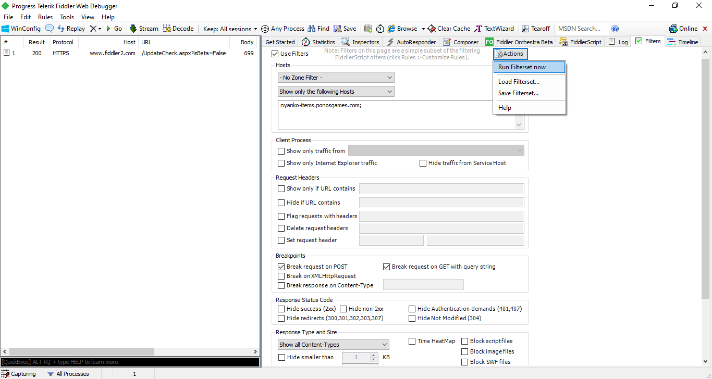
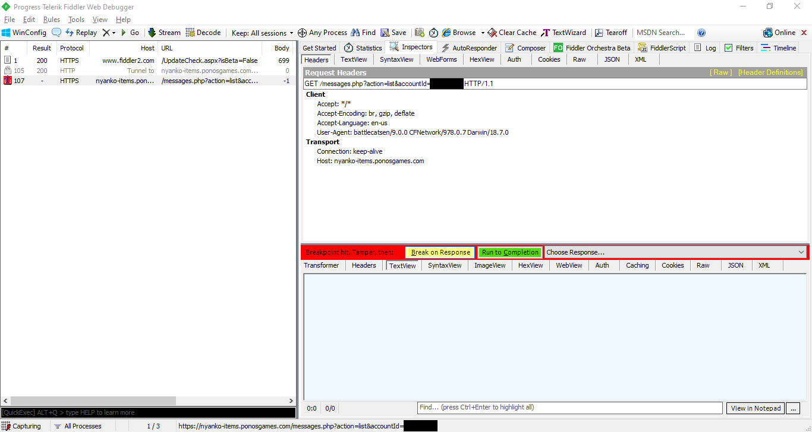
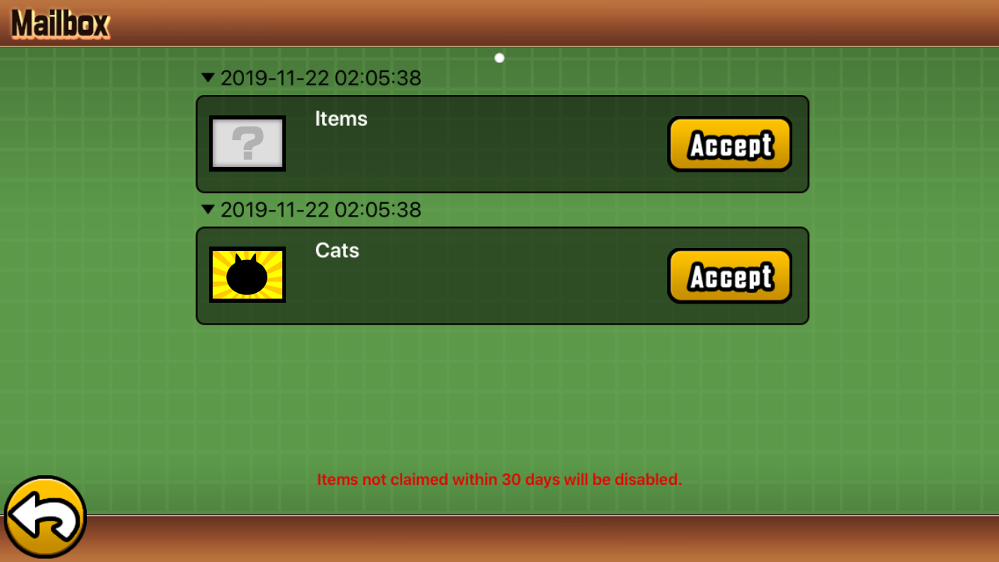
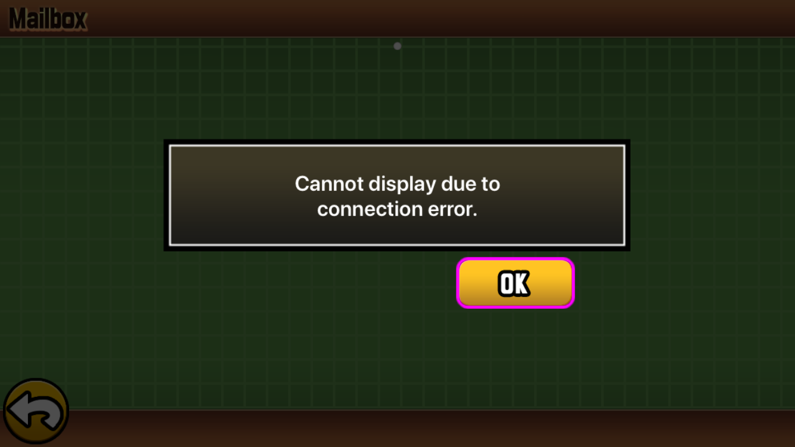
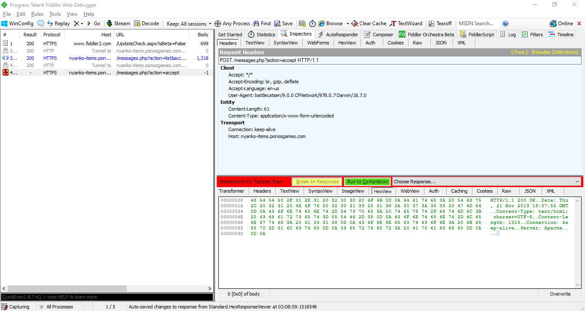

# Cat-In-The-Middle

**Battle Cats MITM Mailbox Hack**

_"Playing it like a fiddle."_

This mailbox hack allows players to acquire items and/or cats of their choice.

## Disclaimer

This repository was made only for research and educational purposes. I am not personally responsible in any way for any unethical malpractices because of this tool. If [PONOS](https://www.ponos.jp/) were to approach me to take down, archive or privatise this repository, I will be obliged to follow their will.

Please support the developers of Battle Cats so that they can add more content for the players of Battle Cats! ヾ(°∇°\*)

As part of responsible disclosure, on 9 Jan 2020, I contacted PONOS Games through [email](mailto:support_en@bc01.ponos.net), [contact/inquiry page](https://www.ponos.jp/contact/inquiry/), and [in-game inquiry](https://ponos.s3.dualstack.ap-northeast-1.amazonaws.com/information/appli/battlecats/contact/en/contact.html) to check with them and update them regarding this MitM vulnerability issue. I have also suggested encrypting the data being transmitted, but they just simply banned my savegame file/account, so... ¯\_(ツ)\_/¯\_

As of Battle Cats version 11.1.0, it seems that [Certificate Pinning](http://fiddler.wikidot.com/certpinning) and [nonces](https://en.wikipedia.org/wiki/Cryptographic_nonce) were implemented. That said, PONOS had never informed me formally/officially about this patch, even after I had responsibly disclosed this issue to them. They might have figured it out internally by themselves and decided to not inform me about it at all (or forgot to inform me).

## Features

1. This hack follows a Man-in-the-Middle (MITM) network approach instead of the usual save data modification (using transfer code and confirmation code). The latter would be more easily detected by the corresponding servers if playing online.

2. As far as I know, this method is also region-insensitive since it just utilizes the main Internet connection to `ponosgames.com`, instead of taking advantage of region-specific package names and hash salts.

3. This method allows users to specifically curate the list of items or/and cats (including expendables like Rare Tickets, Treasure Radars, EXP and Cat Food) that they desire to obtain (such as retrieving cat units locked based on story progress or past limited-edition cat units).

4. Unfortunately, as of version 11.1.0, this method would require rooting/jailbreaking (as mentioned [here](https://github.com/jamestiotio/CITM/issues/7)) due to Certificate Pinning and nonces. Otherwise, versions of Battle Cats lower than v11.1.0 would not require any jailbreaking, rooting or any game cheating/hacking software, except for cases of usage with Android versions beyond `Nougat` (>= 7.0).

## Setup

For the following methods, rooting is required on Android and jailbreaking is required on iOS. While the instructions will be for Android, most of the steps would also be similar for iOS. Feel free to raise a Pull Request to make this section more complete!

> Note that we do not need to worry about the nonces since nonces can only prevent replay attacks, not MITM attacks.

### Remove Certificate Pinning from APK

On Android, it should be possible to use [this tool](https://github.com/shroudedcode/apk-mitm) to patch the APK accordingly and remove the Certificate Pinning. [This comment](https://github.com/shroudedcode/apk-mitm/issues/34#issuecomment-770393173) might also be useful since the `okhttp3` function code is obfuscated in the APK.

### Install MITM Software's CA Certificate as Trusted Root CA Certificate

Additionally, more effort might be needed to install the CA certificate of the MITM software of choice into the system certificate store for Android versions beyond `Q` (>= 10.0). Simply follow the instructions on [this website](https://docs.mitmproxy.org/stable/howto-install-system-trusted-ca-android/) to properly install the CA certificate.

## Usage

> I will develop the `autohack.sh` script further (with maybe a Python script add-on) and maybe add some clearer `.gif` tutorial video recordings when I am less busy and have more time.

We will be using [Fiddler from Telerik](https://www.telerik.com/fiddler) since it is free, so download and install Fiddler on your computer. Of course, you could use [Burp Suite](https://portswigger.net/burp), [mitmproxy](https://mitmproxy.org/), [Wireshark](https://www.wireshark.org/), [Charles Proxy](https://www.charlesproxy.com/), etc. and I would assume that the steps would be similar. Feel free to raise a Pull Request to add instructions for other MITM software as well! At the time of this writing, I was using Fiddler v5.0 (and it was working for Battle Cats v9.7).

### Fiddler

Firstly, connect your mobile device (or emulator) to your computer's Internet connection (possibly through the `Mobile Hotspot` feature).

Next, setup your Fiddler to decrypt HTTPS traffic through SSL proxying (follow [this tutorial](https://docs.telerik.com/fiddler/Configure-Fiddler/Tasks/DecryptHTTPS)).

After that, configure your mobile device to pass their HTTPS traffic to Fiddler (follow [this tutorial](https://docs.telerik.com/fiddler/Configure-Fiddler/Tasks/ConfigureForiOS) for iOS devices or [this tutorial](https://docs.telerik.com/fiddler/Configure-Fiddler/Tasks/ConfigureForAndroid) for Android devices). Do take note that without rooting, this method will only work with Android versions before `Nougat` (< 7.0). Beyond Android `Nougat`, root access would be required.

> You can Google how to root an Android device. After rooting, you can refer to [this page](https://android-developers.googleblog.com/2016/07/changes-to-trusted-certificate.html) to check how to install System-Trusted Certificate Authorities (maybe can use [Magisk](https://github.com/topjohnwu/Magisk)?).

Once the traffic is re-routed through your computer, set a filter in Fiddler's `Filters` tab to show only the host `nyanko-items.ponosgames.com` and tick the options `Break request on POST` and `Break request on GET with query string`. After the filter setup is done, go to `Actions` and press `Run Filterset now`.



On your mobile device (or emulator), open up your Battle Cats and go to the Mailbox (in the bottom-right corner of the Main Menu). Fiddler should show a red-colored `GET` Web Session to `https://nyanko-items.ponosgames.com/messages.php?action=list&accountId=<your-account-id>` so select that and click `Break on Response`.



NOTE: If Fiddler indicates another red-colored `GET` Web Session to `https://nyanko-items.ponosgames.com/api/v2/count.php?accountCode=<your-account-id>`, just let that `Run to Completion` and ignore it as it is not relevant to our objective.

Through `TextView` on Fiddler's `Inspectors` tab, you would be able to edit the response by following this JSON format:

```json
[
  {
    "id": 1,
    "accountId": "<your-account-id>",
    "title": "Items",
    "body": "",
    "clientVersion": 90700,
    "country": "en",
    "accepted": null,
    "created": <unix-timestamp>,
    "items": <item-list>
  },
  {
    "id": 2,
    "accountId": "<your-account-id>",
    "title": "Cats",
    "body": "",
    "clientVersion": 90700,
    "country": "en",
    "accepted": null,
    "created": <unix-timestamp>,
    "items": <cat-list>
  },
  {
    "id": 3,
    "accountId": "<your-account-id>",
    "title": "True Form Cats",
    "body": "",
    "clientVersion": 90700,
    "country": "en",
    "accepted": null,
    "created": <unix-timestamp>,
    "items": <true-form-cat-list>
  },
  {
    "id": 4,
    "accountId": "<your-account-id>",
    "title": "Talent Orbs",
    "body": "",
    "clientVersion": 90700,
    "country": "en",
    "accepted": null,
    "created": <unix-timestamp>,
    "items": <talent-orb-list>
  }
]
```

> You should modify the value of `country` to your respective region defined by PONOS. Possible values include (but might not be limited to): `en`, `jp` and `tw`.

> Also, just to clarify, the value of `itemCategory` indicates the type of item that the user will receive (`0` is `Items`, `1` is `Cats`, `3` is `True Form Cats` and `4` is `Talent Orbs`).

Edit the values of `<your-account-id>`, `<unix-timestamp>`, `<item-list>`, `<cat-list>`, `<true-form-cat-list>` and `<talent-orb-list>` accordingly to valid values. Pick your item, cat, true form cat or/and talent orb choices from the lists provided ([`cat_list.json`](./cat_list.json), [`true_form_cat_list.json`](./true_form_cat_list.json), [`item_list.json`](./item_list.json) and [`talent_orb_list.json`](./talent_orb_list.json)) and feel free to edit the `"amount"`. `"title"` can also be changed to whatever you like.

> For True Form Cats, ensure that the specified Cat actually has a True Form (since not all Cats have True Forms). You can verify against the list on the Battle Cats Wikia on Fandom [here](https://battle-cats.fandom.com/wiki/True_Form).

Forward the response to Battle Cats by clicking `Run to Completion` and it will show the items in the Mailbox.



Take note that if you take too long to do the previous steps, Battle Cats might respond with a timeout (`Cannot display due to connection error`) and you might need to redo the whole process again.



Click the `Accept` button and it will send a `POST` request to `https://nyanko-items.ponosgames.com/messages.php?action=accept`, which will be intercepted by Fiddler again. Click on `Break on Response` again and this time, you need to send a blank `200 OK` response (which you can send through `HexView`) instead of `400 Bad Request`. Edit the HTTP Response Header Fields as follows:

```http
HTTP/1.1 200 OK
Date: Day, DD MMM YYYY HH:MM:SS GMT
Content-Type: text/html; charset=UTF-8
Content-Length: <some-integer>
Connection: keep-alive
Server: Apache


```

Replace `Day`, `DD`, `MMM`, `YYYY`, `HH`, `MM` and `SS` accordingly. The value of `<some-integer>` should be consistent for both the `GET` and the `POST` requests.



Click `Run to Completion` and Battle Cats should show you a dialog box showing that you have received the items/cats specified. Click `OK`.

The corresponding items/cats would then be added to your inventory. Do remember to exercise moderation (or don't even cheat at all!) so as to prevent getting banned.

## Acknowledgements

- Credits to [this Reddit post](https://redd.it/a775je) made by [`u/cmrny`](https://reddit.com/u/cmrny) for the original hacking method, which was actually apparently inspired by [this older post](https://redd.it/2nvmlc) made by [`u/EasyMoneko`](https://reddit.com/u/EasyMoneko), who was an active and very helpful user on the [Battle Cats Subreddit](https://reddit.com/r/battlecats).
- Someone by the username of [`u/NekoB0x`](https://reddit.com/u/NekoB0x) on Reddit, inspired by this repository and the original Reddit post, made an instructional step-by-step tutorial on how to execute this hack on an Android device using `termux`, `iptables` and `mitmproxy`. You can go check it out and follow its steps [here](https://redd.it/gsidq5)!
